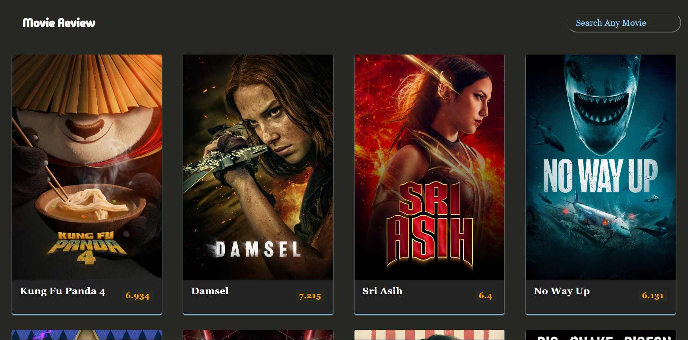

# Movie Review Website

This project is a simple movie review website that allows users to search for movies and view their details, including ratings and overviews.

## Live Demo

You can play the Simon Game online by visiting the following link:
[Movie Review](https://yashchinchole.github.io/Movie-Review/)

## Technologies Used

- HTML
- CSS
- JavaScript
- jQuery
- [The Movie Database API](https://developers.themoviedb.org/3/getting-started/append-to-response) for movie data

## Features

- Search for any movie using the search bar.
- Movies are displayed with their posters, titles, ratings, and overviews.
- Movie ratings are color-coded based on their scores.
  - Ratings >= 8 are shown in green.
  - Ratings >= 5 and < 8 are shown in orange.
  - Ratings < 5 are shown in red.
- Responsive design for different screen sizes.

## Setup

1. Clone this repository.
2. Open index.html in your web browser.

## Usage

1. Enter the name of the movie you want to search for in the search bar.
2. Press Enter or click the search button.
3. The movies matching your search query will be displayed with their details.
4. Hover over a movie to see its overview.

## Screenshots

## Credits

- Fonts: [Google Fonts - Montserrat](https://fonts.google.com/specimen/Montserrat)
- Movie data: [The Movie Database (TMDb)](https://www.themoviedb.org/)
- Icons: [Font Awesome](https://fontawesome.com/)
